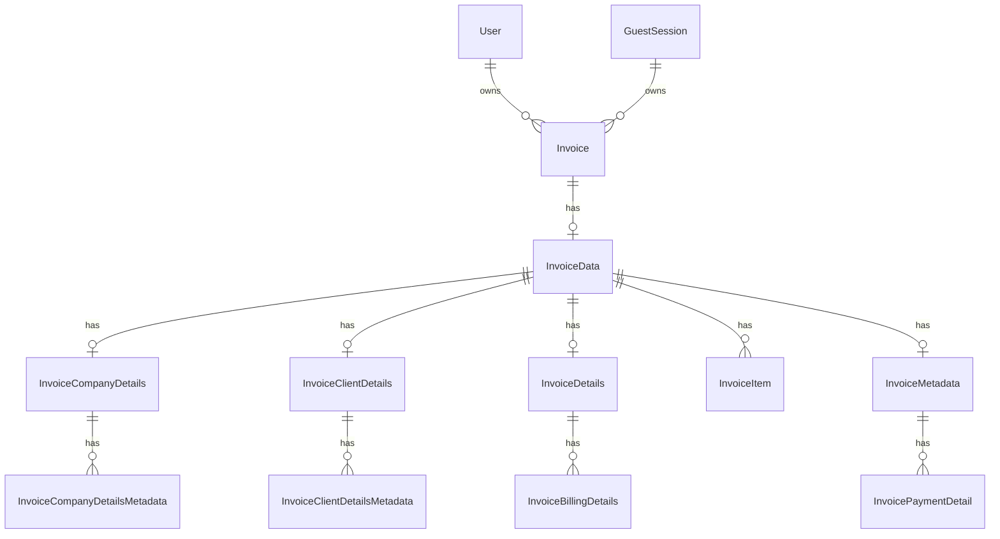

# Backend Context

This backend is an Express API for an invoice application. It supports two ways of using the app:

1. Logged-in users who sign in with Google through Supabase.
2. Guest users who can create and edit invoice data before signing in.

The main purpose of the backend is to let the frontend create, update, list, read, and delete invoices, while keeping ownership tied to either a logged-in user or a guest session.

## What Starts The Server

The entry point is `apps/server/index.ts`.

- It creates an Express app.
- It enables JSON bodies, URL-encoded bodies, and cookie parsing.
- It imports the Supabase client during startup.
- It mounts the auth routes under `/api/v1/google`.
- It mounts the invoice routes under `/api/v1/invoices`.
- It logs `DB connected successfully.` and then starts listening on `process.env.PORT`.

The current server file does not define any other public routes.

## High-Level Structure

The backend is split into a small set of layers:

- `apps/server/index.ts` handles app startup and route mounting.
- `apps/server/api/routes` defines the HTTP routes.
- `apps/server/api/controllers` contains the request handlers.
- `apps/server/api/middlewares` handles authentication behavior.
- `apps/server/api/services` contains OAuth and guest-session helper logic.
- `apps/server/api/validators` defines request validation.
- `apps/server/lib/supabase.ts` creates the Supabase client.
- `packages/db/prisma/schema.prisma` defines the database models.

## Authentication Flow

### Google Login Start

`GET /api/v1/google/auth/login`

- Calls Supabase OAuth sign-in with the Google provider.
- Uses `access_type=offline` and `prompt=consent`.
- Uses `process.env.GOOGLE_REDIRECT_URL` as the OAuth redirect target.
- Redirects the browser to the URL returned by Supabase.

### Google Callback

`GET /api/v1/google/auth/callback`

- Expects a `code` query parameter.
- Returns `400` if `code` is missing.
- Exchanges the code for a Supabase session.
- Returns `400` if Supabase returns an error or no user.
- Uses the Supabase user to find or create a Prisma `User` record by `authId`.
- Updates the stored `fullName` and `avatarUrl` on every successful login so the profile stays fresh.
- If a `guestId` cookie exists, it migrates guest invoices to the logged-in user and clears the cookie.
- Signs a JWT containing the Prisma user id, email, and authId.
- Stores the JWT in an HTTP-only cookie named `token`.
- Redirects the browser to `process.env.FRONTEND_URL`.

### Supabase Client Behavior

`apps/server/lib/supabase.ts` creates the Supabase client with:

- `persistSession: true`
- `flowType: "pkce"`
- `autoRefreshToken: true`

The backend depends on `SUPABASE_URL` and `SUPABASE_PUBLISHABLE_KEY`.

## Invoice Access Model

All invoice routes use `optionalAuthMiddleware`.

- If the `token` cookie is valid, `req.user` is populated and the request is treated as a logged-in user.
- If there is no valid token, the request falls back to guest mode.
- The stricter `authMiddleware` exists in the codebase, but the current invoice routes do not use it.

Guest ownership works through a `guestId` cookie and a `GuestSession` row in the database.

### Guest Ownership Resolution

When an invoice endpoint runs, the backend does this:

1. If `req.user` exists, it uses that user id.
2. Otherwise, it looks for a `guestId` cookie.
3. If there is no `guestId`, it generates one and stores it in an HTTP-only cookie that lasts 30 days.
4. It looks up or creates a `GuestSession` row for that `guestId`.
5. It uses the guest session id as the owner for invoice operations.

## Invoice Routes

All invoice routes are mounted under `/api/v1/invoices`.

### Create Invoice

`POST /api/v1/invoices`

- Resolves ownership first.
- If the request is a guest request, it allows only one invoice per guest session.
- If that guest already has an invoice, it returns `403` with `requiresAuth: true` and a message asking the user to sign in.
- If allowed, it creates an `Invoice` and an empty `InvoiceData` record.

### List Invoices

`GET /api/v1/invoices`

- Resolves ownership first.
- Returns invoices for the current user or the current guest session.
- Supports pagination with `page` and `limit` query parameters.
- `page` defaults to `1`.
- `limit` is clamped between `1` and `25`; with the current code, a missing limit resolves to `1`.
- Returns a pagination object with `total`, `page`, `limit`, and `totalPages`.
- Includes only partial nested data in the list response:
  - client name
  - invoice currency
  - serial number
  - prefix
  - due date

### Get One Invoice

`GET /api/v1/invoices/:id`

- Validates the `id` parameter.
- Resolves ownership.
- Returns `404` if the invoice does not exist.
- Returns `403` if the current user or guest does not own the invoice.
- Returns the fully hydrated invoice record if ownership matches.

### Update Invoice

`PUT /api/v1/invoices/:id`

- Validates the `id` parameter.
- Validates the request body with `saveInvoiceSchema`.
- Resolves ownership.
- Returns `404` if the invoice does not exist.
- Returns `403` if the invoice belongs to someone else.
- Uses a Prisma transaction to upsert and replace nested invoice data.
- Returns the fully hydrated invoice after saving.

### Delete Invoice

`DELETE /api/v1/invoices/:id`

- Validates the `id` parameter.
- Resolves ownership.
- Returns `404` if the invoice does not exist.
- Returns `403` if the invoice belongs to someone else.
- Deletes the invoice.

## Save Payload Shape

The update endpoint accepts a nested invoice payload validated by Zod.

The payload can contain these optional sections:

- `companyDetails`
- `clientDetails`
- `invoiceDetails`
- `items`
- `metadata`

### Company Details

- `name`
- `address`
- optional `logo`
- optional `signature`
- optional `metadata` entries with `label` and `value`

### Client Details

- `name`
- `address`
- optional `metadata` entries with `label` and `value`

### Invoice Details

- `theme`
- `currency`
- `prefix`
- `serialNumber`
- `date` as an ISO datetime string
- `dueDate` as an ISO datetime string
- optional `billingDetails`

Each billing detail has:

- `label`
- `type` set to `fixed` or `percentage`
- `value`

### Items

Each item has:

- `name`
- `description`
- `quantity`
- `unitPrice`

### Metadata

- optional `notes`
- optional `terms`
- optional `paymentDetails` entries with `label` and `value`

## How Saving Works Internally

`saveInvoice` does not patch individual nested rows one by one in isolation. Instead, it:

1. Validates the request body.
2. Resolves who owns the invoice.
3. Confirms the invoice exists and belongs to that owner.
4. Ensures an `InvoiceData` parent row exists.
5. Runs all nested writes inside one Prisma transaction.
6. Replaces metadata arrays by deleting old rows and inserting the new ones.
7. Replaces the invoice items list the same way.
8. Fetches the full invoice again and returns it.

This means the frontend should send the complete current state for nested sections it wants to overwrite.

## Database Model Shape

The Prisma schema shows the invoice data hierarchy.

### Important Models

- `User` stores the Google-authenticated account.
- `GuestSession` stores guest ownership and expiry.
- `Invoice` is the top-level invoice record and tracks status.
- `InvoiceData` is the hub for all nested invoice content.
- `InvoiceCompanyDetails`, `InvoiceClientDetails`, `InvoiceDetails`, `InvoiceItem`, and `InvoiceMetadata` store the invoice sections shown in the frontend.
- Metadata child tables store repeated label/value entries.

### Status Fields

`Invoice` has a status enum with these values:

- `pending`
- `paid`
- `failed`
- `expired`
- `refunded`
- `cancelled`

The current controller code does not expose a dedicated endpoint for changing payment status.

## Files That Matter Most For Frontend Work

- `apps/server/index.ts` for the mounted routes.
- `apps/server/api/routes/auth/google.route.ts` for login and callback URLs.
- `apps/server/api/controllers/auth/google.controller.ts` for login success behavior.
- `apps/server/api/routes/invoice/invoice.route.ts` for invoice endpoints.
- `apps/server/api/controllers/invoice/invoice.controller.ts` for invoice payload behavior.
- `apps/server/api/validators/invoice.validator.ts` for the exact save payload shape.
- `packages/db/prisma/schema.prisma` for the database relationship model.

## Frontend Notes

- After Google login, the backend redirects to `FRONTEND_URL` and sets the `token` cookie.
- The frontend should not expect to store the JWT manually.
- Guest users can work with invoices until they sign in, at which point guest invoices are migrated to the user account.
- The frontend should mirror the nested save payload exactly for invoice editing.
- The list endpoint returns a smaller projection than the single-invoice endpoint, so the frontend should not expect all nested data from the list response.
